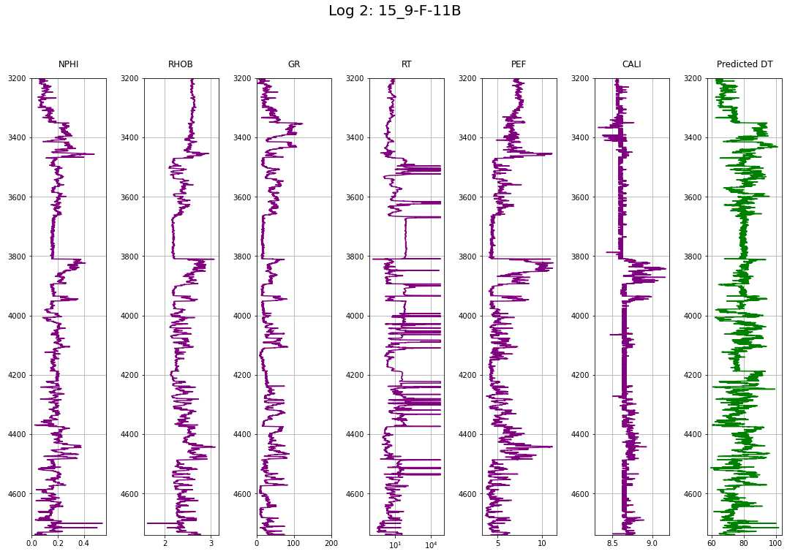
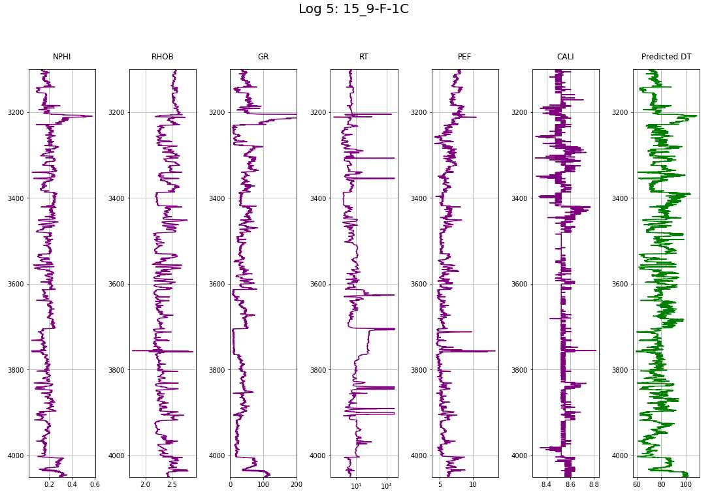

# Equinor Volve LogML

This repository is my exploration on bringing machine learning to the Equinor "Volve" geophysical/geological dataset, which was opened up to be explored by the public in 2018.
For more information about this open data and how to obtain the original version visit <a href="https://www.equinor.com/en/how-and-why/digitalisation-in-our-dna/volve-field-data-village-download.html" target="_blank">Equinor's Data Village</a>.
The full dataset contains ~ 40,000 files!

## Background
The Volve field in the Norwegian North Sea: 2008—2016. 
The Volve oil field, located 200 kilometres west of Stavanger (Norway) at the southern end of the Norwegian sector, was decommissioned in September 2016 after 8.5 years in operation, more than twice as long as originally planned. 
The development was based on production from the Mærsk Inspirer jack-up rig, with Navion Saga used as a storage ship to hold crude oil before export.
Gas was piped to the Sleipner A platform for final processing and export.
Volve reached a recovery rate of 54% and in March 2016 the licence decided to shut down its production permanently.
The field was originally scheduled for 3-5 years of operation.
<a href="https://www.equinor.com/en/what-we-do/norwegian-continental-shelf-platforms/volve.html" target="_blank">Reference</a>

## Data

Five .LAS well logs

- 15_9-F-1A
- 15_9-F-1B
- 15_9-F-1C
- 15_9-F-11A
- 15_9-F-11B

The .LAS files contain the following feature columns:

| Name   | Unit             | Description                                                   | Read More |
|--------|------------------|---------------------------------------------------------------|-----------|
| Depth  | [m]              | Below Surface                                                 |           |
| NPHI   | [vol/vol]        | Neutron Porosity (not not calibrated in basic physical units) |<a href="https://www.glossary.oilfield.slb.com/en/terms/n/neutron_porosity" target="_blank">Reference</a>          |
| RHOB   | [g/cm3]          | Bulk Density                                                  |<a href="https://www.sciencedirect.com/topics/engineering/density-log" target="_blank">Reference</a>            |
| GR     | [API]            | Gamma Ray radioactive decay (aka shalyness log)               |<a href="https://www.glossary.oilfield.slb.com/en/terms/g/gamma_ray_log" target="_blank">Reference</a>         |
| RT     | [ohm*m]          | True Resistivity                                              |<a href="https://www.glossary.oilfield.slb.com/en/terms/r/resistivity_log" target="_blank">Reference</a>          |
| PEF    | [barns/electron] | PhotoElectric absorption Factor                               |<a href="https://www.glossary.oilfield.slb.com/en/Terms/p/pef.aspx" target="_blank">Reference</a>           |
| CALI   | [inches]         | Caliper, Borehole Diameter                                    |<a href="https://www.glossary.oilfield.slb.com/en/terms/c/caliper_log" target="_blank">Reference</a>           |
| DT     | [μs/ft]          | Delta Time, Sonic Log, P-wave, interval transit time          |<a href="https://en.wikipedia.org/wiki/Sonic_logging" target="_blank">Reference</a>           |

## Problem

Wells 15/9-F-11B and 15/9-F-1C lack the DT Sonic Log feature.

## Goal

Predict the Sonic Log (DT) in these two wells.

## Workflow

1. The wells containing the Sonic Log DT are used for training: Well 15/9-F-11A, 15/9-F-11A, and 15/9-F-1B.
2. Transformation using the Yeo-Johnson method of power transformation.
3. Outlier removal with the One-Class SVM method.
5. Best performance achieved by Gradient Boosting.
6. Hyperparameter tuning showed the best hyperparameter of Gradient Boosting as follows; `n_estimators`=1,000 and `max_depth`=100.
7. Tune Hyperparameters on train logs and score on validation logs (same as training) logs.
8. Predict Sonic Log DT on test logs 15/9-F-11B and 15/9-F-1C.

## Results

Scores of all Gradient Boosted Regression models were >0.95. Tuning improved the R2 by ~0.025

Best ranked model:

* mean_test_score R2: 0.973404
* std_test_score: 0.001976 	

